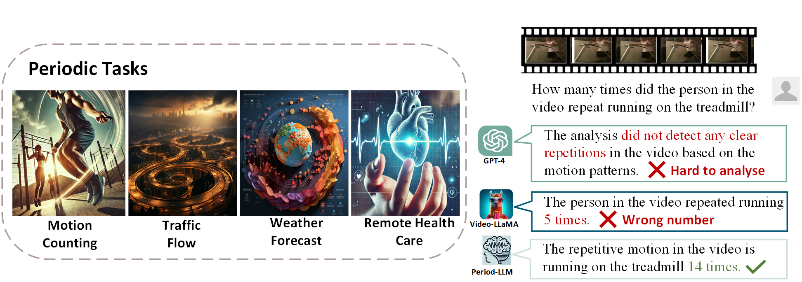
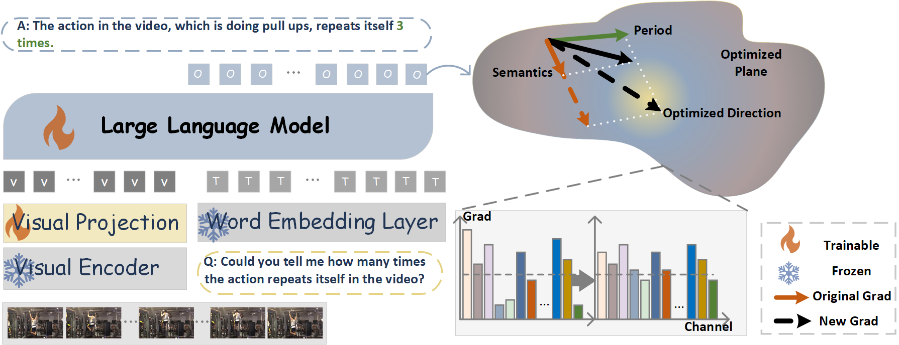

# Period-LLM: Extending the Periodic Capability of Multimodal Large Language Model

This repository contains the code for **Period-LLM**, a multimodal large language model designed to enhance the performance of periodic tasks across various modalities. This work is accepted and presented at **CVPR 2025**.



## Abstract

Periodic or quasi-periodic phenomena reveal intrinsic characteristics in various natural processes, such as weather patterns, movement behaviors, traffic flows, and biological signals. Given that these phenomena span multiple modalities, the capabilities of Multimodal Large Language Models (MLLMs) offer promising potential to effectively capture and understand their complex nature. However, current MLLMs struggle with periodic tasks due to limitations in: 1）Lack of temporal modeling. 2）Conflict between short and long periods. This paper introduces **Period-LLM**, a multimodal large language model designed to enhance the performance of periodic tasks across various modalities, and constructs a benchmark of various difficulty levels for evaluating the cross-modal periodic capabilities of large models. We adopt an **"Easy to Hard Generalization"** paradigm, starting with relatively simple text-based tasks and progressing to more complex visual and multimodal tasks. This ensures that the model gradually builds robust periodic reasoning capabilities. Additionally, we propose a **"Resisting Logical Oblivion"** optimization strategy to maintain periodic reasoning abilities during semantic alignment. Extensive experiments demonstrate the superiority of **Period-LLM** over existing MLLMs in periodic tasks.



## Data Preparation

### **Word-Repetition-QA Dataset**

The **Word-Repetition-QA** dataset can be found on [Hugging Face](https://huggingface.co/datasets/kekeYeah/Word-Repetition-QA). This dataset focuses on text-based periodic reasoning tasks, where the model needs to determine how often a specific word appears in a given text.

#### Example:

```json
{
    "QA": {
        "q": "I'm wondering how frequently the word \"passing\" appears in this text. \"passing passing passing passing passing passing passing passing passing passing passing\" ",
        "a": "The word \"passing\" appears 11 times in the given text."
    }
}
```

You can download the dataset using the following command:

```bash
from datasets import load_dataset
dataset = load_dataset("kekeYeah/Word-Repetition-QA")
```

### Countix-QA Dataset

The **Countix-QA** dataset, available at [Hugging Face](https://huggingface.co/datasets/kekeYeah/Countix-QA), contains multimodal periodic reasoning tasks. The dataset includes video data and corresponding QA pairs where the model is asked to determine the frequency of repeated actions or answer questions about the content of the video.

#### Example 1: Video-based periodic reasoning

```json
{
    "video": "./cut_countix_train/jc0LLWn191k.mp4",
    "QA": {
        "q": "How often is the repeated action performed in the video?",
        "a": "The repeated action in the video, which is swimming butterfly stroke, is performed 8 times."
    }
}
```

#### Example 2: Video description-based reasoning

```json
{
    "video": "./cut_countix_train/jc0LLWn191k.mp4",
    "QA": {
        "q": "Can you share your thoughts on the content of this video?",
        "a": "Certainly! The video showcases a dynamic swimming session in a large pool. It's quite active with multiple swimmers, both men and women, gliding through their lanes with ease. A notable feature is the presence of colorful flags above the water, adding a competitive atmosphere to the scene. One man, in particular, captures attention with his proficient butterfly stroke technique, which he demonstrates repeatedly throughout the session. In fact, his consistent motions across the water's surface are replicated a total of eight times, highlighting his skill and endurance. The attire of the swimmers, including a mix of wetsuits and swim gear, suggests a serious swimming practice or event. The presence of a brown wooden rail and a red and white theme in the attire and banners gives the setting a structured and possibly festive or team-oriented feel. Overall, the video exudes a sense of energy and dedication to the sport of swimming."
    }
}
```

You can download the dataset using the following command:

```bash
from datasets import load_dataset
dataset = load_dataset("kekeYeah/Countix-QA")
```

## Installation

### Prerequisites

- Python 3.x
- PyTorch
- Other dependencies are listed in `requirements.txt`.

To install the required dependencies, use:

```bash
pip install -r requirements.txt
```

### Running the Code

1. Clone this repository:

```bash
git clone https://github.com/keke-nice/Period-LLM.git
cd Period-LLM
```

2. To train and infer the model on the periodic tasks:

```bash
bash run.sh
bash infer.sh
```

Ensure that the dataset is properly downloaded and processed before training. More details can be found in the [Data Preparation section](https://chatgpt.com/c/67d58acb-52c0-800c-b44c-0f3e36d63d6c#data-preparation).

### Evaluation

After running the model, you can evaluate its performance on periodic reasoning tasks by calculating the  metrics, such as MAE, RMSE:

```
python evaluation.py
```

Additionally, you can evaluate prediction accuracy using the standard NLP metrics, such as BLEU, CIDEr, METEOR, ROUGE_L, and SPICE:

```
python eval.py
```

## Citation

If you find this code helpful, please cite our paper:

```
@article{zhang2025period,
  title={Period-LLM: Enhancing Periodic Task Performance with Multimodal Large Language Models},
  author={Zhang, Yuting and Lu, Hao and Hu, Qingyong and Wang, Yin and Yuan, Kaishen and Liu, Xin and Wu, Kaishun},
  journal={CVPR 2025},
  year={2025},
  note={Accepted and presented at CVPR 2025},
}
```

